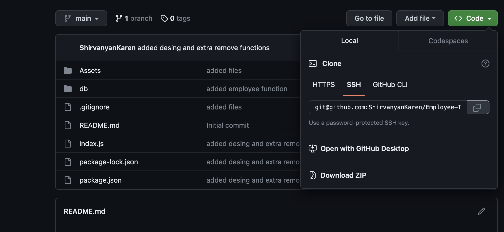
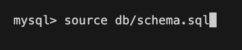
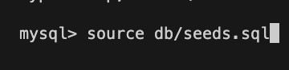
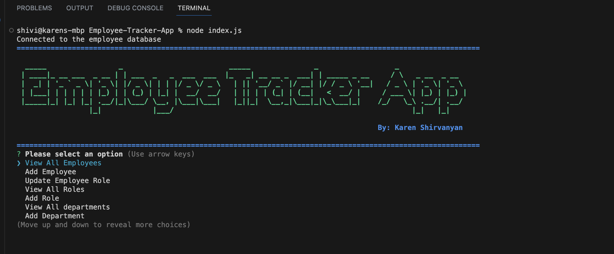

# Employee-Tracker-App

## Technology used
| Technology Used         | Resource URL           | 
| ------------- |:-------------:| 
| Deployed Video  | [https://drive.google.com/file/d/1NSvNjPHJcDH1mmXqFJEZpC8IawIUmF60/view](https://drive.google.com/file/d/1NSvNjPHJcDH1mmXqFJEZpC8IawIUmF60/view) |
| My Repository      | [https://github.com/ShirvanyanKaren/Employee-Tracker-App](https://github.com/ShirvanyanKaren/Employee-Tracker-App) |
| Node JS          | [https://nodejs.org/it/docs](https://nodejs.org/it/docs) |
| MySQL          | [https://dev.mysql.com/doc/](https://dev.mysql.com/doc/) |
| MySQL2 NPM  | [https://www.npmjs.com/package/mysql2#using-prepared-statements](hhttps://www.npmjs.com/package/mysql2#using-prepared-statements) |
| Git | [https://git-scm.com/](https://git-scm.com/)     | 


# Description

The purpose of this application is to allow the user to access a company database to perform actions such as add, manage, and view departments, roles, and employees. 

The application had to meet the following acceptance criteria:

```md
GIVEN a command-line application that accepts user input
WHEN I start the application
THEN I am presented with the following options: view all departments, view all roles, view all employees, add a department, add a role, add an employee, and update an employee role
WHEN I choose to view all departments
THEN I am presented with a formatted table showing department names and department ids
WHEN I choose to view all roles
THEN I am presented with the job title, role id, the department that role belongs to, and the salary for that role
WHEN I choose to view all employees
THEN I am presented with a formatted table showing employee data, including employee ids, first names, last names, job titles, departments, salaries, and managers that the employees report to
WHEN I choose to add a department
THEN I am prompted to enter the name of the department and that department is added to the database
WHEN I choose to add a role
THEN I am prompted to enter the name, salary, and department for the role and that role is added to the database
WHEN I choose to add an employee
THEN I am prompted to enter the employee’s first name, last name, role, and manager, and that employee is added to the database
WHEN I choose to update an employee role
THEN I am prompted to select an employee to update and their new role and this information is updated in the database 
```

Here is an example of how the application runs:


## Table of Contents
* [MySQL and Node JS](#mysql-and-node-js)
* [Usage](#usage)
* [License](#license)
* [Questions](#questions) 


## MySQL and Node JS


The employee tracker application was made from scratch with the inquirer and mysql2 npm packages as well as mysql to initialize the database. The mysql2 extenstion was used to create a connection between the initiated sql database and the local index.js file.

### MySQL initialization

The database has to first be initialized through the MySQL schema and seed files. This allows a structure and initial values to the table.

```sql
CREATE TABLE department (
    id INT NOT NULL AUTO_INCREMENT PRIMARY KEY,
    department_name VARCHAR(30) NOT NULL
);


CREATE TABLE roles (
    id INT NOT NULL AUTO_INCREMENT PRIMARY KEY,
    title VARCHAR(30),
    salary DECIMAL,
    department_id INT NOT NULL,
    FOREIGN KEY (department_id)
    REFERENCES department(id)
    ON DELETE CASCADE
);


CREATE TABLE employee (
    id INT NOT NULL AUTO_INCREMENT PRIMARY KEY,
    first_name VARCHAR(30),
    last_name VARCHAR(30),
    role_id INT NOT NULL,
    FOREIGN KEY (role_id)
    REFERENCES roles(id)
    ON DELETE CASCADE,
    manager_id INT,
    FOREIGN KEY (manager_id)
    REFERENCES employee(id)
    ON DELETE CASCADE
);
```
The tables can be linked and joined together via FOREING KEY's. This allows us to access the information and sift through it within our query's. In this instance, we create a link with the job roles to the department id, a link with employee roles with the role id, and an internal link in the employee table with employee id to manager id. This essentially allows us to access the employees salary, position, and relative department

### Inquirer and Query Configuration

Through the use of inquirer prompts, we can direct the user to specific querries listed within functions that fullfill their requests. In this instance, I later linked these options to functions with switch cases.

```js
const displayMenu = () => {
    inquirer.prompt([
        {
            type: "list",
            name: "choice",
            message: "Please select an option",
            choices: [
                "View All Employees",
                "Add Employee",
                "Update Employee Role",
                "View All Roles",
                "Add Role",
                "View All departments",
                "Add Department",
                "Remove Employee",
                "Remove Role",
                "Remove Department",
                "Exit"
            ],

        }
    ])
...
}
```

For instance if the the user selected add Role, the following case would lead to the function addRole:

```js
case "Add Role":
 addRole();
```
After initializing another inquirer prompt within the function to collect information such as the name of the role, salary, and the department it belongs to, I then passed these reponse variables to initiate a db.query. The db.query, in which db is defined as the mysql2 connection to the database, essentially allowed me to update the database given the query parameters that include MySQL syntax. 

```js
.then((response) => {
            const { title, salary, department } = response;

            const department_id = departments.findIndex((dept) => dept === department) + 1;

            const addRoleQue = `
            INSERT INTO roles (title, salary, department_id)
            VALUES (?, ?, ?)
            `;

            db.query( addRoleQue, [title, salary, department_id], (err, results) => {
                if (err) {
                    console.error("Error adding the role:", err);
                } else {
                    console.log("Role added successfully!");
                }
                init();
                displayMenu();
            });

            });     
```

The following line of code captures the user inputs from the prompts, and effectively adds the new role into the database as well as the roles array that I used to access and reference the database. The findIndex includes a '+1'
incrementation as the id of the department stored in the database starts at 1 rather than 0 which is the case for the array index. This allowed to find the corresponding department id to the role listed by the user. 

```js
const init = () => {
    departments = [];
    roles = [];
    employees = [];

...

    db.query("SELECT title FROM roles", (err, data) => {
        roles = data.map((element) => element.title);
    });

...

};
```

This is passed through the init function at the end of the query to map the new employee, department, or in this case, role to the array. This makes it accessible for the user with future prompts.


## Usage 

This application can be used to manage employees within a company. To use simply clone or fork this repository.



After cloning down the repo, make sure to run npm install to install the necessary dependencies. Following this, you can modify the inputs of the database to your liking within the seeds.sql file. After this, run your mysql and create the database by using "source". 





Finally, you can enter your password, user, and database name and run node index.js to update the database via the prompts on you command line.



        
        
## License 
     
MIT licensing with permisions such as commercial use, modification, distribution and private use. Limitations include liability and warranty.

## Questions 

* Check out my other projects on my [my Github](https://github.com/ShirvanyanKaren)
* For any additional questions or concerns, please email me at kshirvanyan2000@gmail.com